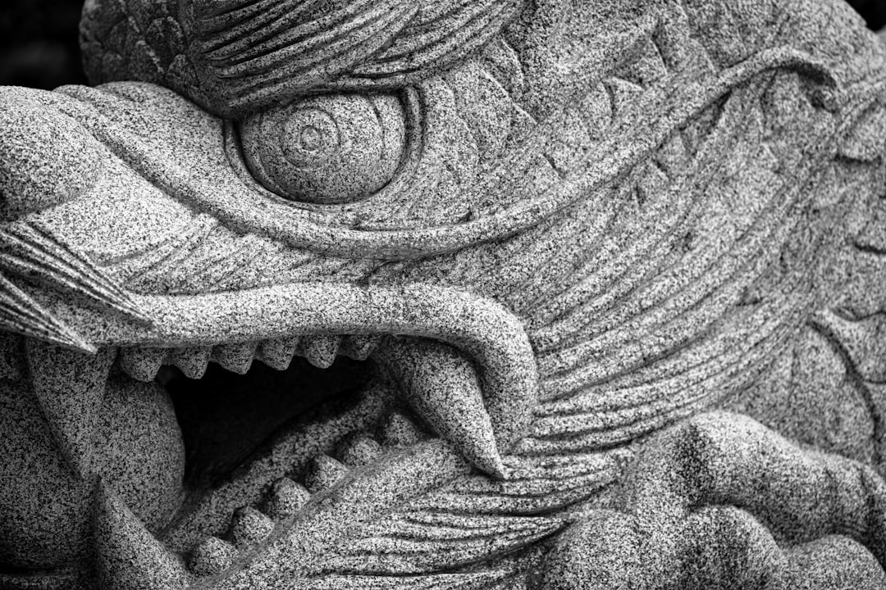
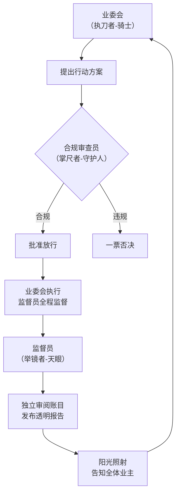

## 一套实现小区长治久安的权力制衡终极框架

看看你的小区，是不是也这样？——新业委会上任前，信誓旦旦“管好每一分钱”；成立后，连公共收益的账单都成了一笔糊涂账，想查都查不到。

这几乎是每个小区的经典剧情：一群满怀热血的业主挺身而出，组成业委会，誓言为大家监督物业、守护家园。他们，是众人期待的 **“屠龙少年”**。

然而，剧本常常在此时反转。掌握了公章和账本的“少年”们，渐渐发现自己身处无人监督的领地。曾经的承诺可能被遗忘，决策变得独断，公共资金流向成谜。**屠龙的少年，自己却长出了鳞片，变成了那条新的“恶龙”。**

我们不禁要问：问题出在人品，还是制度？

答案是：**空谈道德永远敌不过制度的漏洞。** 我们必须设计一套让“恶龙”无法产生、甚至不敢产生的制度。

今天，我们基于《民法典》的授权，提出一套名为 **“小区治理铁三角”** 的模型。它的核心目标，就是**用“制度之锁”，锁住变龙的欲望。**

## 一、 “屠龙”为何总失败？权力的腐蚀从不偶然

少年为何会变龙？因为他独自掌握了“屠龙刀”（决策权）、 “钱袋子”（财务权）和“隐身衣”（信息权）。缺乏制约的绝对权力，是对人性的巨大考验。

在小区里，这意味着：
*   **业委会身兼“立法、行政、监督”三职**，自己提方案、自己审批、自己执行、自己记账。
*   **业主监督形同虚设**，看不懂报表、看不到合同、跟不上流程，最终只能被动接受结果。

这套有缺陷的制度，才是滋养“恶龙”的土壤。

## 二、 破解之道：“铁三角”分权，将权力关进笼子

我们不再奢求找到永不腐败的“圣人”，而是通过精巧的制度设计，让普通人也能安全地行使权力。

“铁三角”模型，就是将集中的权力一分为三，打造一个稳固的制约闭环。为了更直观地理解，您可以通过下图看清这个完美的制衡闭环：

**（核心制衡闭环图示）**

如上图所示，这三个角色构成了稳固的“铁三角”：

*   **【掌“尺”者：合规审查员】**——他不再是少年，而是 **“规则的守护人”** 。他手持《议事规则》这把尺子，不负责提议干活，只负责衡量业委会的每一个重大决定是否“合乎规矩”。**任何动用资金、签署合同的行为，必须先过他这一关。** 他拥有 **“一票否决权”** ，提前将违规操作扼杀在摇篮里。

*   **【执“剑”者：业主委员会】**——他们是 **“行动的骑士”** ，回归其服务与执行的本质。他们负责提方案、办事务，但**“剑”已不再能随意挥舞**。他们的任何重大行动，都必须先获得“守护人”的规则批准。从此，他们无法再私自决定“屠龙刀”该砍向哪里。

*   **【举“镜”者：监督员】**——他是 **“真实的镜子”** ，是全体业主永不闭合的“天眼”。他独立审阅每一笔账目，紧盯业委会和审查员是否各司其职，并**按季度发布《透明报告》，将一切照射在阳光之下**。他的存在，让“隐身衣”彻底失效。

**这个闭环的精髓在于：** 执剑的骑士（业委会）想行动，必须得到掌尺的守护人（审查员）批准；而他们俩的所有行为，都在举镜的监督员（监督员）的凝视之下，并向全体“村民”（业主）实时直播。

## 三、 最后的防线：当系统失灵，我们如何“屠龙”？

即便制度如此严密，我们仍需设想最坏的情况：万一三角中的两者甚至三者勾结，我们该如何应对？

我们设置了最终的 **“村民起义”机制**：

**任何一位普通村民（业主），只要你拿起法律武器（如起诉业委会不公开账本）并获胜，这份法院的胜诉判决，就会像一道终极咒语，立即触发整个系统的“重置程序”——现任的业委会、审查员、监督员将全体自动下岗，由政府部门介入，协助我们选举新的治理团队。**

这确保了，**法律，永远是每位业主手中最强大的“屠龙术”。**

## 结语：从“依赖圣人”到“信仰制度”

“铁三角”模型，其伟大之处不在于它能保证选出的永远是“少年”，而在于它能**有效防止任何坐在这个位子上的人变成“恶龙”**。

它用分权制衡的制度，取代了对个人道德的脆弱信任。这标志着我们小区治理从充满不确定性的“人治”冒险，迈向了稳定、透明的“法治”征程。

现在，是时候用一套更先进的制度，来守护我们共同的家园了。**想让你家小区也落地这套“铁三角”制度？请转发本文到业主群，下次业主大会，我们一起把它提上议程！**

因为这把“锁”，锁住的不仅是公共的钱袋子，更是我们每一位业主对美好社区的长期信任。
