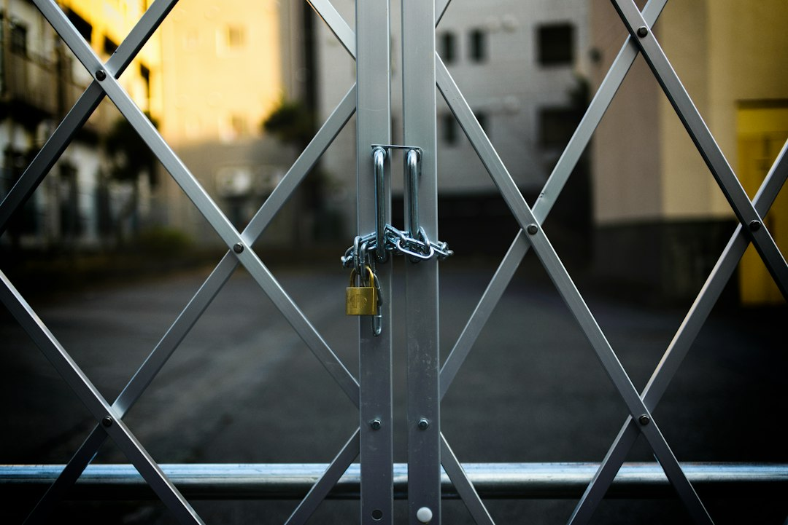

小区又有业主在提议召开业主大会临时会议。
先不说发起者提出的“拟表决议题”是否符合法律法规，我仅从程序本身判断来下个结论：这事办不成。
所以我选择了不参与。

有人可能会说，你不试试怎么知道？
不好意思，这事我在几年前就试过。
那时我想通过提议召开业主大会临时会议，罢免乱作为的业委会。
作为提议的发起人，我试图通过在线表单，收集占总人数20%的业主的签名、房产证和身份证扫描件。结果应者寥寥。
有业主建议我暂时不要将房产证和身份证扫描件作为前置条件。我采纳了建议，签名的人的确是多了。
但是再多的签名，没有业主身份证明材料支撑，充其量只能证明本小区住户支持罢免业委会意愿之强烈，而不能触发召开业主大会临时会议的程序。
打个比方，你打官司，要交给法院的是起诉状，而不是请愿书。因为只有起诉状，才能触发法院的立案程序。
虽然有 20% 的业主提交了签名，但是我明白我是无论如何也收不齐这些业主的身份证明材料的。最终我选择了中止行动。

法律讲的是主体资格和证据链，而不是看签名多声势大。

《业主大会和业主委员会指导规则》第二十一条规定，业主委员会应当及时组织召开临时业主大会的情形之一，是“经专有部分占建筑物总面积20%以上且占总人数20%以上业主提议的”。
（注：各地物业管理法规的具体表述可能略有差异，但核心逻辑完全一致。）

再看我们小区《议事规则》第十三条 业主大会临时会议：

> 下列情形之一的，应当召开业主大会临时会议：（一）经20%以上业主提议；（二）业主委员会委员缺额人数超过委员总数30%的；属第一款第一项情形的，应符合下列条件：有明确发起人；提议事项明确，属于业主大会议事范围；随附提议人房地产权证复印件。业主委员会接到提议书面申请后应对所提供的议题进行分析、研究，认为有必要核实的可以对签名的真实性和有效性等进行核实。……

注意，我们小区《议事规则》只写了“20%以上业主提议”，没有《指导规则》那样明确面积条件。不过，我认为《指导规则》作为上位规范，“面积20%+人数20%”的双重要求仍然适用。

看到了吧，这里有两个法律要件——“业主”与“面积”。
若只有签名，你让受理方怎么核验：

1. 签名的“张三”是租客还是业主？
2. 张三是业主，他拥有的专有部分面积是多少？
3. 签字是不是张三本人签的？

今天的问题并不是受理方故意想卡发起人，而是发起人自己就越不过法定程序的门槛。（这里我们不讨论这个门槛的合理性）

所以我说“提议召开业主大会临时会议”，这是一个不可能完成的任务。
如果为了合规去收房产证和身份证复印件，在陌生人社会里，没有官方背书，普通业主绝不可能把核心个人隐私交给你一个民间发起人；
如果为了降低门槛不收业主身份证明材料，那么收集再多签名，在法律上也过不了最基本的形式审查。
