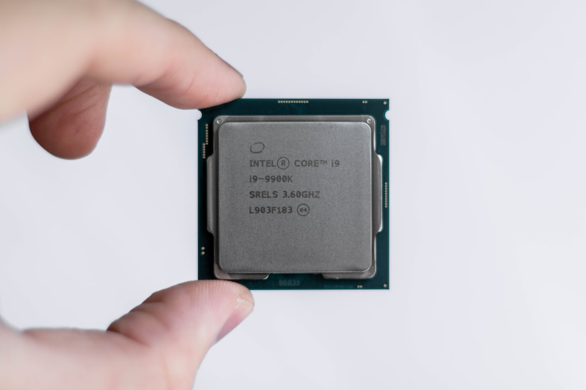

1994年的冬天，北京中关村。

柳传志坐在一间不算宽敞的办公室里，桌上摆着两份报告。

一份，是联想当年的销售数据——PC机销量正在爆发式增长，利润可观，现金流健康。另一份，是研发部门递上来的技术投入计划——数字触目惊心，且三五年内看不到任何回报。

他选择了前者。

三十年后，这个选择成了中国互联网上最著名的“原罪”之一。

---

## 一、有一种声讨，叫做“事后诸葛亮”

网上长期存在的对联想的声讨，不外乎这么些话：

“华为当年砸钱研发，今天登顶了。联想为什么不学？”
“柳传志格局太小，只顾眼前利润，错失了成为中国英特尔的机会。”
“‘贸工技’的路线，是联想最大的战略失误。”

这些声音听起来义正辞严，却都犯了同一个错误——**用后来才能看到的结果，去审判当年的决策者。**
像这种声讨，我们将它叫做“事后诸葛亮”，这显然不是什么赞美之词。

不过，话要说清楚，我们对“事后诸葛亮”嗤之以鼻，倒不是说联想的战略假设和能力建设不值得复盘，但这个复盘应当是严肃的，考虑到方方面面的因素，而不是拿着刘翔的奖杯去质问姚明：你当初为什么不练跨栏？

---

## 二、上个世纪90年代，那块土壤里能长出什么花？

我是1990年参加工作的，恰好又是和电脑打交道，所以我对那块土壤是有所了解的。

90年代的中国，个人电脑主要由企业购买,“芯片”对绝大多数人来说都是陌生的词。
当时的中国万事待兴：人才供给、产业链分工、资本市场、知识产权保护、研发融资渠道、长期主义的制度环境——几乎都还在起步。

在这样的土壤里，要求一家企业押注“纯粹的长期研发”，意味着什么？

意味着你要在没有配套人才的市场里自己培养工程师，意味着你要在没有上游供应商的环境里自建基础设施，意味着你要在专利体系形同虚设的时代里，独自承担研发成果被抄袭、被绕开、被拖垮现金流的风险。

>[!NOTE]纯粹的长期研发
>它是指任何一种“毕其功于一役”的核心技术研发，它的投入大、时间长、回收慢，失败后企业很可能倒闭。像自研“CPU”芯片就是一种纯粹的长期研发。
>被今天网友神话的联想总工程师倪光南，当年力主芯片研发，常被叙述为“受排挤离开联想”。鲜为人知的故事是，他离开联想之后，研发了基于“方舟一号”芯片的电脑，拿到了国家真金白银的投资，政府还给了他几万台电脑订单，结果呢？全打了水漂。
>可见在那个年代，芯片这事，从实验室到产业化、商业化，不是科学家一个人就能解决的。100个倪光南、400个亿都解决不了。

绝大多数企业不押注“纯粹的长期研发”，不是他们不够勇敢，而是当时的土壤在很大程度上决定了他们应该选择播下什么花的种子。

华为后来走通了技术路线，有任正非的意志与组织能力，也有深圳特区的制度环境，更有行业结构的加成：电信设备天然更偏“系统工程”——涉及部署、运维、长期服务与客户关系锁定，技术投入的回报机制更稳定、更可预测（来自续费/运维），虽然周期也很长。可不管怎么说，在当时，这条路线并不显得“必然正确”。

而PC产业则更偏“规模化制造 + 供应链 + 渠道 + 品牌”的运营型竞争，技术当然重要，但壁垒形态与回收模型不同：它更容易被规模与供应链效率重塑，也更容易被全球标准化体系压平单点研发优势。

更准确地说：**在90年代的普遍环境下，大多数企业都不具备以“纯粹的长期研发”作为战略主轴的系统条件；华为是少数在特定赛道与组织机制下跑出来的“幸存者”，而不是一个可以批量复制的模板。**

而“幸存者”这个词之所以重要，是因为它提醒我们：当年“纯粹的长期研发”的先行者并不在少数——有人因资金链断裂倒在了黎明前，有人被专利壁垒与市场窗口碾过，有人押错了方向就再也没有第二次机会。**历史会为登顶者写传，却很少替山腰的亡者立碑。我们今天能反复讲述的成功故事，天然带着幸存者偏差。**

现实通常是：企业做决策，领导者不会基于“伟大还是平庸”来拍板，而是在想“决策失败了，企业还能不能活”。

---

## 三、“贸工技”不是逃避技术，而是先把客户造出来

“贸工技”在很多人嘴里，等于“不做技术”，但这是一个粗暴的简化。

联想在1990年代真正在做的事情是：建立渠道与交付能力，建立质量与服务信誉，把“PC这种新产品”规模化地送到用户手里。用德鲁克的话说，这叫**先把客户创造出来**。没有客户，谈什么技术积累都是空中楼阁。

而当你承认“创造客户”本身就是一项战略任务，你就会明白：联想当时的选择不是“要不要技术”，而是“技术投入应该如何排序”。

与其问一句空泛的“联想为什么不做芯片”，不如问一组更具体、也更有管理价值的问题：

在渠道与规模做起来之后，联想在哪些技术能力上投入了？哪些投少了？哪些方向的判断事后看来可以调整？

产品工程、供应链优化、质量体系、制造工艺、关键部件的联合研发、服务体系的标准化、管理系统与组织能力——这些层次的技术积累，和“自研芯片”并不是一回事，却同样是企业技术底盘的一部分，也是可以被严肃讨论、被复盘、被迁移的方法论。

把“没押注某个单点前沿”直接等同于“战略短视”，是把一道复杂的**管理问答题**简化成了非黑即白的**是非选择题。**

---

## 四、柳传志的“有限理性”

有一个关于航海的古老难题：在没有GPS的年代，船长如何在茫茫大海中确定方向？

答案是，他们依靠指南针、星象、洋流、风向，以及代代相传的经验——做出当时条件下最合理的判断。

在马奇—西蒙这一脉的组织决策研究里，有一个经典概念：有限理性。它的意思是，人的决策不可能建立在“信息完备、计算无限、时间充裕”的理想条件上，而总是在信息、认知与时间的约束下完成。也因此，评价一个决策的质量，不能只盯着事后的成败，更要看决策者在当时的约束之内，推理是否合理、取舍是否一致。

而德鲁克讲得更直接：管理首先是一种实践。你必须在不完备信息下行动，并为结果负责。所谓“有效决策”，不是先知先觉，而是把问题问对、把边界条件想清楚，然后在可行的选项里下注。

用这个标准来看1994年的柳传志——

他看到的是：PC需求爆炸式增长，市场窗口稍纵即逝；研发投入周期漫长，失败后可能拖垮现金流；竞争对手随时可能抢占渠道；中国的技术基础设施远未成熟，孤军押注长期研发的失败概率极高。

在这些约束下，他选择先建立客户基础和规模效益，再谈技术升级。这个逻辑，在当时的语境里有其内在的严密性。

你可以说它在后来的历史进程中显出了局限，但你很难说它在当时是一个“没有经过推理”的决策。

---

## 五、真正的问题，从来不是站哪队

批评联想的人，往往把问题简化成了一道选择题：技工贸 vs 贸工技，选哪个？

但真实的商业世界里，没有这种干净的选择题。

华为今天的成功，是无数个具体的、偶然的、难以复制的历史节点叠加的结果。我们今天看到的华为，是那个“活下来”的版本。而那些同样在90年代押注技术研发、却在某个路口耗尽现金流的企业，早已消失在了历史的记忆里，没有人替它们写故事，也没有人替它们总结经验。

所以，与其争论“联想应该学华为”，不如学会用同一套方法论去评价任何一个历史决策。

在开口之前，先把三个问题问完：

> [!TIP] 目标、约束、可选方案
> 第一问：当时的**目标**是什么？生存、规模、现金流、客户积累、能力建设，优先级如何排序？
> 第二问：当时的**约束**是什么？资本、人才、供应链、制度环境、时间窗口，哪些是真实存在的边界？
> 第三问：当时的**可选方案**有哪些？不只是A和B，而是一组可行策略，每个方案的主要风险是什么？

这三个问题问下来，很多看起来“显而易见的错误”，会变得复杂得多。很多看起来“理所当然的成功”，也会变得偶然得多。

管理的第一责任，是把问题问对。答案会随时代变化，但问题一旦问错，行动就会在错误的轨道上高效奔跑。

但也正因为如此，我们对历史的评价不该止步于“起点是否合理”。
如果说1994年的选择是一种“生存理性”，那么更值得复盘的，是企业在后来积累了规模与资本之后，是否在某些关键节点被既有成功路径锁住，错过了必要的“变轨窗口”。

**这并不是否定当初，而是所有大公司都会遇到的命题：如何在既有优势仍然有效时，为下一轮竞争提前建设能力。**

>[!NOTE] “变轨窗口”是什么意思？
>我这里说的“变轨”，不是放弃主业，更不是追风口。
>它指的是：在主业现金流仍然健康时，企业识别到关键假设正在变化（利润池迁移/关键能力替换/组织惯性反噬），于是提前做一次能力结构与组织机制的重配——该砍的砍、该补的补、该换的换。
>“窗口”的意思是：此时企业还有资源与容错空间，错过时机再动手，往往只能被动求生。

因此，在复盘一家公司的成长路径时，还要问第四个问题：它在什么时候、因为什么，错过了那次该变轨的窗口。

---

## 尾声

1994年的那个冬天，柳传志选择了那份销售报告。

我们永远无法知道，如果他选择了另一份，历史会如何走向。也许联想会成为中国的英特尔，也许联想会在五年内耗尽现金流，成为一个被时代遗忘的名字。

但我们知道的是：他是在自己所能看见的世界里，做出了他认为最合理的选择。

这就是所有决策者的宿命——**在迷雾中前行，在不确定中下注，然后接受历史的检验。**

而我们这些后来者，至少可以做到一件事：

**在开口审判之前，先把“目标、约束、可选方案”三个问题问完。**

---