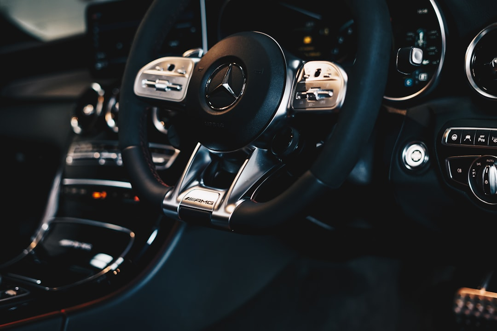

# 我批评的不是新势力造车，而是用“快消范式”造车

你有没有发现，今天越来越多的车，正在被当成“消费电子”来做？

炫酷第一、极简第一、屏幕第一。发布会一上来先讲算力、讲大屏、讲交互，安全设计反倒像“默认存在”的背景板。

更典型的是另一件事：**高频 OTA**。一周一个版本、两周一个版本——如果改的是皮肤、音乐、导航，这顶多叫体验迭代；但如果改的是灯光、雨刮、门锁、换挡、驾驶辅助这些关键逻辑，潜台词往往就是：有 Bug 没关系，我下周再修。

软件行业的常识是：版本更新越频繁，**越可能说明上线前的边界覆盖不够**。
手机软件测试不充分，不至于闹出人命。而汽车里的软件测试不充分，那是有可能让用户送命的。

> [!NOTE] 什么叫“边界覆盖”
> 写软件时，最容易出问题的往往不是“正常情况”，而是那些**少见但一旦出现就很要命的边界情况**。
> **边界覆盖**说的就是：在发布前，是否把这些“少见情况”尽可能都测过一遍。
> 举几个车里最常见的边界：
> * 语音把“阅读灯”听成“所有灯”这种**相似指令**
> * 屏幕卡顿/黑屏/断电时，关键功能是否还可用
> * 雨天、戴手套、手湿、强反光下的触控误操作
> * 同时发生两件事：比如正在导航+来电话+自动驾驶提示+用户下指令
>
> 所以“版本更新越频繁，越可能说明边界覆盖不够”，意思是：
> **不是大功能没做完，而是上线后不断被真实世界的“少见情况”打脸，只能靠补丁追着修。**

我相信你这几天刷到过一条视频，用户给车机发指令“关闭所有阅读灯”，结果车机关了包括大灯在内的所有灯。用户两眼一抹黑，幸亏车速不是很快，只是撞上了路边护栏。

这类问题的可怕之处在于：你根本没有“解释空间”，只有事故后果。

**真正充分的测试，应该发生在封闭环境里；而不是让几十万用户用每天的通勤去帮你做测试。**

这篇文章要批评的，就是这种正在蔓延的“快消范式”：

> **把车当消费电子来做，炫酷设计第一，安全设计第二，再借助高频 OTA 把用户当回归测试员。**

它不属于某个品牌，也不只发生在“新势力”。如果追溯这种范式的源头，特斯拉是一个绕不开的名字——它最早把“屏幕优先”做成了行业审美，让后来者争相效仿。

---

## 一、范式领袖：特斯拉如何把“屏幕优先”做成了行业审美

在智能车机普及之前，人与车的交互方式，一直是经由“实体按键”，它们的存在天经地义，从来没有人质疑过它们为什么要存在。

特斯拉做了一件很聪明也很危险的事：它取消了大量实体按键，使用触控大屏并引入了智能辅助驾驶，彻底颠覆了人与车的交互方式。我们可以像操作手机一样方便地操控车辆，满满的科技美感，惊艳了整个汽车行业。

然而凡事有利就有弊，一个细节就足够说明问题：2023年Model 3改款时，特斯拉取消了传统转向拨杆，把转向灯操作迁移到方向盘上的触摸按键，换挡则移到了中控屏幕。这项设计推出后，在多个市场引发大量用户与媒体的批评，核心抱怨集中在“盲操作困难、误触、方向盘转动后按键位置错乱”。

更具讽刺意味的是——两年后，特斯拉在中国市场悄悄为Model 3重新标配了转向拨杆，同时为部分老车主推出了付费加装服务，价格2499元。本该有的东西，先拿走，再让你自己花钱装回来。

这件事看起来并非火烧眉毛的危险，但它精准暴露了“屏幕/触控优先”逻辑的结构性问题：**为了设计语言的统一，牺牲了驾驶任务最需要的那种可靠性，无谓增加了引发事故的风险。**

一俊遮百丑，消费者只看见了特斯拉的科技美感，愿意为它买单。
当市场开始奖励“极简”和“炫酷”，跟风就不再是选择题，而是生存题。
行业于是开始追逐领袖，即便是传统车企也被感染跟风，纷纷引入触控大屏。

我们必须认识到，驾驶是一种特殊任务：只要汽车还没有取消方向盘，那么你的眼睛必须在路上，像换挡之类的交互就应该是盲操作。而将本不适合触控的操作强行纳入屏幕，出现问题是早晚的事。

---

## 二、快消范式的四个特征：你一眼就能认出来

为了避免把“新势力 vs 传统车企”写成口水战，我把“快消范式”定义成四条可观察的特征：

1. **关键操作入口收敛到屏幕/菜单**：双闪、除雾、雨刮、灯光、换挡、驾驶辅助激活……需要“找”。
2. **应急路径不直观**：断电/碰撞后怎么开门、后排怎么逃、应急装置在哪，要靠说明书。
3. **交互规则频繁变化**：今天是这个手势，明天换另一个入口；今天这么提示，明天换一种逻辑。
4. **高频 OTA 兜底心态**：缺陷先上路，再靠版本迭代“慢慢补齐”，尤其是涉及关键操纵与安全逻辑时。

这四条放在手机上是效率；放在车上是风险。因为车的风险不是“体验差”，而是“你在慌张的时刻做错动作”。

我相信不少人现在坐网约车，都有过这种经历：到了目的地，手在门板上摸了半天，不知道该拉哪里、按哪里才能下车。你不必尴尬——这事我也经历过。

这个例子同时命中了第 2 条和第 3 条：逃生路径不直观 + 规则千人千面。

这正是“快消范式”的典型症状：把本该一秒钟完成的逃生动作，做成了需要学习、需要记忆的交互。
平时最多是麻烦，可一旦发生事故——那一秒，你需要的是肌肉记忆，而不是产品说明书。
很多人以为“这只是不好用”，实际上，它是在用运气替你兜底——细想就很可怕。

---

## 三、为什么实体按键不是情怀：盲操作不是“方便”，是“少死几个人”

你可能会问：实体按键真有这么重要吗？

重要的不是“按键本身”，而是它能帮人形成的一种能力：**盲操作**。

对不常开车的人来说，“盲操作”这个词可能有点陌生。我用电脑打字举个例子你就明白了：每天用电脑的人不需要低头看键盘，眼睛盯着屏幕，手指就能准确敲出每一个字——因为实体按键让你形成了稳定的肌肉记忆。

开车时的盲操作，意义更直接：它能让你把注意力始终留在前方的路面上，而不是分给屏幕和菜单。高速行车时，低头看两秒钟屏幕，车就已经盲开出几十米——这两秒，可能正是一起事故的临界点。

所以最近发生的一个变化特别有象征意义：大众公开承认，未来车型将把关键功能的物理控制重新带回来，不会再犯同样的错误。

与此同时，Euro NCAP 在 2026 年新版评分协议中，把关键控制的布置、清晰度、易用性正式纳入考核，明确鼓励物理按钮以减少分心，同时要求电动门把手在碰撞后必须保持可用，以便救援。

这两个信号合在一起只说明一件事：**大家跟风跑了一圈，发现“快消范式”错了，开始认真地往回纠错。**

---

## 四、不要把“安全”理解成堆料，也不要被高频 OTA 蒙蔽

很多车企讲安全喜欢讲“看得见的东西”：钢多少、梁多厚、气囊几个、碰撞成绩多漂亮。这些当然重要，但它们主要回答“撞上了怎么办”。

而汽车工业真正要回答的是：**怎样把你尽可能安全地从 A 点移动到 B 点？**

很多事故不是先撞，而是先失控——车不按你的意图走，不按你的意图停。所以真正的安全设计，既包括事故后怎么逃生，也包括：**紧急情况下车能不能稳、能不能停、能不能按你想要的轨迹躲过去。**

“快消范式”最致命的地方，就是在这两件事上都留了口子。

**堆料那一侧**：一辆车不是堆“车规级零件”就能堆出安全的。当一辆车把“快”和“猛”当卖点，它就必须在配套上更保守——刹车、轮胎、悬架、抓地力、车身姿态控制要形成闭环。卖点越激进，底座越要保守。

**OTA 那一侧**：我不反对 OTA 用来修地图、修娱乐、优化体验。但快消范式的问题，是把 OTA 当成“上市前验证不足”的许可证：关键逻辑先推上路，再靠版本去补。于是用户的肌肉记忆被反复改写，关键时刻你没时间读更新日志，只能靠本能——而本能已经被上一个版本训练过了。

**每周 OTA 的车，本质上是在公路上做回归测试。**
手机上的 Bug 叫体验问题，车上的 Bug 叫公共安全问题。

---

## 五、中国为什么出手——不是等“出事再追责”，而是提前把底线焊回去

海外的纠错路径往往是：事故后追责 + 评级体系倒逼。代价是“先出事再修”。

中国的路径更像“提前划红线”。工业和信息化部组织修订强制性国家标准《汽车操纵件、指示器及信号装置的标志》**征求意见稿**，明确提出转向信号灯、车窗升降、组合驾驶辅助系统激活等应装备实体操纵件；其核心目的就是：让关键操纵件可达、可用、基本可盲操，减少对屏幕与视觉的依赖，降低分心风险。

你可以把它理解为：当企业用“快消范式”把底线做散了，监管把底线重新焊回来——该直达的必须直达，该独立可用的必须独立可用。这会压缩一部分“炫酷设计”的空间，但也减少了普通人用生命去试错的概率。

这与 Euro NCAP 2026 年的评分导向是一致的：评级体系正在把这些底线重新变成必答题。

---

## 收尾：我批评的不是谁，我批评的是一套把风险外包给用户的做车方式

真正值得批评的不是“新势力”这个群体，也不是某一家企业。我批评的是一种正在蔓延的做车方式：

* 用炫酷与极简换取注意力；
* 用屏幕与菜单交换盲操作；
* 用高频 OTA 把验证成本转嫁给用户；
* 用“你适应一下”代替“我替你兜底”。

真正的安全，往往藏在看不见的地方：

藏在关键操作“伸手就能按对”的克制里；
藏在应急路径“断电也能用”的保守里；
藏在驾驶任务“少分心、少误触、可预期”的基本常识里；
藏在“该在封闭环境测试的，就不要丢给公路”的职业伦理里。

你可以追求创新，但请先搞懂什么叫可靠。
你可以追求销量，但请记住：**每一辆车卖出去，都有人在里面生活。**

别让快消范式把用户变成小白鼠，毁掉整个行业的底线。

---
