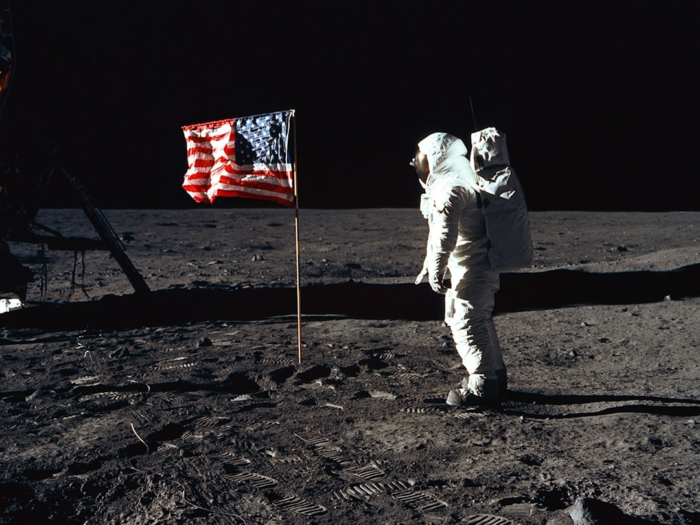

这个世界上不缺少从未被揭露的阴谋，但那些阴谋的规模通常很小、参与人数不多。
而我不相信的是：一个规模巨大、参与人数众多的阴谋，在长达几十年时间内却始终未被揭露。

拿登月来说。
至今仍有人认为美国登月是一场造假，月面着陆和活动，是通过地面伪造影像完成的。他们列出各种“疑点”，言之凿凿。
但这些人有没有想过一个问题：**苏联当时为什么没有发现？**
1969年，美苏正处于冷战最激烈的阶段。太空竞赛本质上是一场国家颜面之争，苏联输掉登月已经够难堪了。如果美国是在造假，苏联有一切动机去揭穿它，政治上可以打击对手，舆论上可以扳回一城，外交上可以让美国颜面尽失。
可苏联不仅没有发现造假，甚至从未公开质疑过登月的真实性。
以苏联的情报能力和政治动机，沉默本身就是最强证据。

说到苏联的情报能力，有一个更直接的对比。
美国造原子弹，将核心人员集中在一处严密管控，保密工作已经做到极致，但苏联间谍还是渗透进去了，提前掌握了关键情报。
登月计划比造原子弹规模更大，参与人数更多，人员分散在全国各地的研究机构、制造工厂、发射基地。你告诉我，这样一个项目，对苏联的保密工作，能比造原子弹做得更好？
连曼哈顿计划都没能瞒住苏联，登月造假凭什么能瞒住？

退一步说，假设苏联真的什么都没发现，那还有一个问题需要解答：
整个阿波罗计划，科研人员、工程师、承包商、管理层，数以十万计的人，他们每天在干什么？
如果登月是假的，这十万人是全都参与了造假，还是全都被蒙在鼓里？
如果全都参与了，十万人守口如瓶几十年，这本身就是一个比登月更难完成的壮举。
如果全都被蒙在鼓里，那谁在真正推进这个造假项目？少数几个人，能骗过每天在实际工作中处理数据、检验结果、对接系统的十万名工程师和科学家？
你觉得现实吗？

我来说个类比。
假设马斯克宣布要把人送上火星，几年后，他向全世界直播了宇航员登陆火星的画面，但其实，那是在摄影棚里拍的，或者是他一个人用 AI 做出来的视频。
你认为这件事能瞒多久？
马斯克的 SpaceX 有多少工作人员与外部合作方？
这些人每天在和真实的系统和数据打交道，迟早会有人发现对不上，迟早会有人站出来。

宏大阴谋的问题是：**参与的人一旦足够多，就无法确保每一个人终身都能守口如瓶。**
这是一个结构性的结果，与策划者意愿和能力无关。
所以，我从不相信“宏大阴谋”。

---
