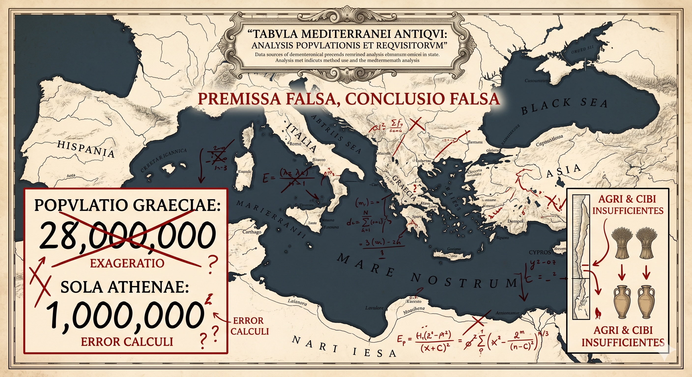

**想用农业约束来检验古希腊，本来无可厚非。问题在于：伪史论者设错了前提，套错了模型，结论自然也是错的。**

---

伪史论者说：

> “希腊半岛多山，可耕地狭小，按古代农业生产力，最多只能养活几十万人。如果古希腊真的存在所谓‘雅典帝国’，人口动辄上百万，养活这么多人的粮食从哪里来？”

一个比较有名的伪史论者还进行了一番“精密计算”：假设古希腊人口 2800 万，假设古希腊时代周边地区亩产与法国 18 世纪晚期持平，且周边所有剩余粮食全部出口给希腊，那么，需要 335 万平方公里的农田和 2.35 亿农业人口。而整个古代欧亚大陆的总农田面积，也远没有这个数，更不用说农业人口了。

他为了反驳“进口粮食说”，同时计算了雅典的进口运输能力：假设雅典有 100 万人口，每人每天消耗 1.5 斤粮食，以当时的运输水平，雅典需要建立 91.25 万人的运粮船队。也就是说，年满 5 岁的雅典男女全都得去当海员，苏格拉底和柏拉图也不例外。

下面我们不讨论“古希腊文明到底是真是假”，只分析这套论证能不能成立。

## 一、“古希腊人口 2800 万”这个数字是拼出来的

今天希腊的国土只有 13 万平方公里，而古希腊城邦分布的范围，并不局限于这一小块半岛，而是横跨爱琴海、小亚细亚、南意大利乃至黑海沿岸的广阔区域。从空间上看，它不是一块封闭、贫瘠的土地。

**在鼎盛时期，这个城邦网络的总人口大约有 750 万到 1000 万人，他们分散在一千多个城邦中。各个城邦规模差异很大，像雅典这样的几十万人口的城邦，不是古希腊城邦的常态。**

2800 万这个数字是怎么来的？伪史论者大概是把希波战争时期、伯罗奔尼撒战争时期、亚历山大东征时期的人口估算累计到了“古希腊”头上。

问题在于：这三个时期相差超过一个世纪，地理范围各不相同，统计口径也完全不一致，把它们拼成一个总数，就像把唐朝、宋朝、明朝的人口加在一起，再去计算“中国的农田够不够养活这些人口”，明显是搞错了前提。

再说雅典的人口：公元前 5 世纪鼎盛时期，总人口（含公民、外邦人与奴隶）大约在 25 万到 35 万之间。这个数字来自雅典剧院容量、军役登记和住房密度考古的交叉推算；学界估算是 15 万到 40 万不等，但 25 万到 35 万是目前引用较多的区间。无论取哪个数，都不是“上百万”。

用一个虚构的人口总数，再套在今天的希腊地图上去算粮食，不管怎么算，结论都只会是“不够”。

---

## 二、雅典的粮食缺口到底有多大

第一章已经说明，雅典从未有过 100 万人口。不过，即便按 25 万到 35 万计算，本地农业也确实不足以支撑这样一个城市规模，部分粮食只能依赖进口。

根据古代演说材料与铭文研究的综合估算，雅典每年从黑海方向输入的谷物，大约在 40 万到 80 万麦多伊诺斯之间。这一规模大致可以支撑约 7 万到 17 万人口，相当于雅典总人口的四分之一到二分之一。
麦多伊诺斯是古希腊谷物计量单位，1 麦多伊诺斯约合 40 到 50 升，大致相当于一个人 1 到 2 个月的口粮。这里说的“黑海方向”，主要是指乌克兰草原一带，它是雅典的重要粮源之一。

注意，这种进口体系的运作方式是：

> **大宗海运 + 集中入库**

不同吨位的商船一次装载数十吨到上百吨粮食，按批次进入港口，卸至粮仓。
雅典港口比雷埃夫斯设有大型粮仓，这一点已有考古证据支持。

伪史论者凭空将雅典的人口数量夸大了数倍，等于同时把粮食缺口和运输需求都放大了数倍，又预设出一个低效率的运输水平。使用错误的前提和模型，运算过程再准确，答案也是错误的。

## 结语

用农业约束来检验古希腊，思路本身没有问题。
问题在于，伪史论者先改写了前提条件和模型，然后再去做计算。
这种方法，怎么可能证明“古希腊文明”是假的？

---
