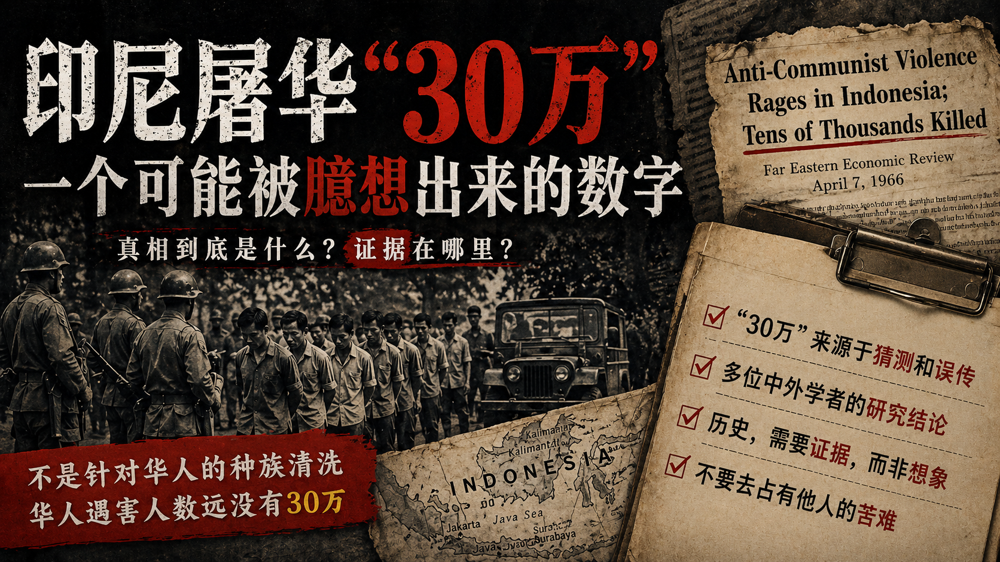

某度搜索“印尼 排华”，跳出来的大部分结果就是“30万华人被屠杀”。
我曾经以为这是事实，但是经过一段时间的学习和研究，我现在可以非常认真的告诉你：

**到目前为止，没有任何可靠的证据表明：1965年，苏哈托上台之后，屠杀了30万华人。**

不要跟我说有图有真相，几张照片，怎么能证明30万华人被屠杀？
请问，你能告诉我30万这个数字，出处在哪里吗？
南京大屠杀20万~30万，学术界考证过，有出处，有推断，最后形成共识。而印尼，屠杀30万华人，学术界考证过，但找不到任何可靠的证据。只有（简体中文）自媒体，倒是形成了共识，在传播层面，一个说法被反复引用的时候，很容易被人当作“常识”。

通过这篇文章，我将说明为什么我认为“30万”是一个可能被臆想出来的数字，而并非历史事实。
本文的论证核心是：“30万”这个数字不成立，而不是“否定华人在930事件中受害”。
我把它拆成了两个问题

- 问题一：那场屠杀的目标到底是不是华人？（还原事件的背景和性质）
- 问题二：华人遇害的实际规模到底可能是多少？（数据考证和逻辑推理）

> [!NOTE]声明
> 我从未否认印尼存在着排华的历史，排华过程中有成千上万的华人受到伤害或被杀害，华人的财产遭受严重损失。印尼前总统苏哈托犯有反人类罪行。

## 历史背景

### 关于印尼的华人和华侨

上个世纪5、60年代，由于历史原因，在印尼的数百万华侨同时具有荷兰和中国“双重国籍”。
1949年~1954年，新中国承认华侨的双重国籍。
1954年印尼有华侨300万，入印尼籍者约占总数的30%，即90万人，而拒绝入印尼籍者占70%，即210万人保留中国籍。（印尼外侨事务局的统计）
到了1955年，两国政府达成协议，中国正式宣布放弃印尼华侨的“双重国籍”身份。
1960年，协议生效，可印尼不想为华侨入籍打开方便之门，故意设立了苛刻的入籍条件。
1965年“930事件”前，具有中华人民共和国国籍的华侨有1,134,420人，“无国籍者”1252人。（印尼移民厅公布的资料）

### 关于印尼的“930事件”

印尼建国时，首任总统苏加诺（Sukarno）便向共产主义靠拢。
1965年则是印尼共产党最兴盛的时期，拥有300万名党员（另有一说是350万名），势力无所不在，遍布党政军，广受支持。当时，印尼共产党是仅次于中共和苏共的世界第三大共产党。
同一年9月30日，印尼时任总统苏加诺的亲信、据称也是印尼共产党党员的总统卫队营长翁东（Untung Syamsuri）发动政变、绑架并杀害了6名右翼军方将领。
时任陆军少将苏哈托（Suharto）推翻苏加诺政权，展开长达32年的右翼军人独裁统治，而为了清除印尼共产主义势力，1965年至1966年间，军方镇压及屠杀大批共产党员。
那场大屠杀具体死亡人数至今仍未有确切数字，历史学者普遍认为，反共大屠杀造成多达50万人死亡，史称“930事件”。

## 问题一：那场屠杀的目标到底是不是华人？

**学术界的共识是：苏哈托政府是“反共而非针对华人”，被屠杀的左派总数大约是50万人。**

当然，我们不能因此直接推导出“华人没有被大规模波及”；同样，也不能反过来推导出“华人一定被大规模波及”。
但必须认识到，很多人（包括以前的我）头脑中的推理链是错误的：

1. 印尼共产党和中国共产党都是共产党，印共必定亲中共；
2. 华人亲中国，华人必定亲印共，多数华人会加入印共，即“华人≈印共”；
3. 历史上荷兰殖民者利用华人加强其统治，故印尼土著和华人之间长期存在敌意；
4. 华人擅长经商，可比作亚洲的犹太人。印尼对华人抱有的敌意在社会学上可能类似于欧洲对犹太人抱有的敌意，而在某些时刻，这种敌意可能会被统治者利用，升级为种族灭绝；
5. 结果，30万华人被屠杀可谓是顺理成章的

关于印尼共产党中到底有多少华人，虽然缺乏绝对精确的历史统计，但“华人占比极高”的说法，很大程度上是因为刻板印象导致的，人们想当然地以为华人亲近中国，印共也亲近中国，所以必然有大量华人加入了印尼共产党。
但事实真的是这样吗？
克雷·鲍文在《从骨灰上三起三落的印尼共产党--印尼共产党简史》中提到，到1965年8月，印尼共产党有三百五十万党员，若加上附属组织，印共据称获得大约二千万人民的支持。然而有意思的是，我翻遍了这篇20多页的简史，通篇竟然没有一个字提到华人。是作者刻意忽视华人吗？当然不是，这说明华人在印共核心党员中的真实占比非常低。这也能够解释：为什么当时的印尼共产党高层中几乎没有华人。
其实，当时的左翼华人更多是加入了一个名为“印尼国籍协商会（Baperki）”的左翼社会团体，而不是直接成为印共党员。这就进一步切断了传言的底层逻辑：既然大多数左翼华人根本就不在印共的名册上，那么军方那场以“彻底歼灭印共”为明确目标的定点清洗，又怎么可能等同于一场针对华人的大规模屠杀呢？

深入研究“930事件”的历史学家、加拿大不列颠哥伦比亚大学历史系副教授约翰・鲁萨（John Roosa）在接受德国之声采访时候解释，当年的反共大屠杀是针对印尼共产党而来，并非华人，过去曾有论述将该事件塑造成“反华种族清洗”或“屠华事件”，都是不对的。华人对该议题相对敏感，源自于当年印共亲中国，华人就被视为共产党员，而成为清洗的目标，反华只是反共屠杀的一部分，但不能因此而称“930事件”为“屠华事件”。

2017年，《种族灭绝研究》杂志上刊发了一篇论文，《大屠杀的机制：将印度尼西亚杀戮理解为种族灭绝的案例》，作者是美国耶鲁大学麦克米伦中心的杰西·梅尔文（Jess Melvin）。
作者在前印度尼西亚情报机构的档案中找到了证据，首次能够证明军方是1965-1966年印尼事件背后的主要机构。之前大家总以为不存在任何书面的证据，命令都是口头下达的。
**文件显示，军方领导将这场运动描述为一场“歼灭行动”，并以“彻底歼灭”军方的主要政治对手印尼共产党（PKI）为明确意图。**
该文语境下的“种族灭绝”采用广义学术定义，将政治社群、意识形态群体纳入保护范畴，并非特指血缘 / 种族层面的种族清洗，全文并无针对华人种族灭绝的档案证据。

## 问题二：华人遇害的实际规模到底可能是多少？

如我在开头所述，“30万华人被屠杀”，更多见于简体中文互联网，而英文媒体和学术材料通常谈的是1965—1966年印尼大屠杀造成“数十万人”死亡，尽管有个别学术论文提及了“30万或50万华人遇害”，但是作者未标出此数据的来源。

事实上，对于“930事件”后，数十万华人遇害的说法，学术界从未发现证据。
不管是过去的苏哈托政府，还是今天的政府，也不可能公布任何数字。他们手头有没有数字，还是一个疑问。

**目前我们能查到的“数十万”的出处，是1966年4月《远东经济评论》上的一篇社论，其中提到：印尼的反华情绪在最近几个月达到了血腥的高潮，有报道称在反左翼暴动中有数十万人死亡。**
这句话有两个关键词：反华，反左翼。
人们的刻板印象是：那个年代的华人=左翼，左翼死亡数十万=华人死亡数十万
基于猜测而产生的反华大屠杀传说的雏形就此植入了读者的脑海。

> [!TIP]注意
> 1967年，印尼军队在西加里曼丹省杀害了大约数千名印尼华人，作为镇压在邻国马来西亚砂拉越开展活动的华裔游击队的一部分，这是印尼与马来西亚对抗的一部分。这些杀戮是自1940年代革命时期暴力事件以来对印尼华人最严重的袭击，但通常不被认为是1965-66年大屠杀的一部分，也早已有独立的历史研究专门做过处理，因此不在本文讨论“30万”这个数字的范围之内。

### 澳大利亚学者的解释

澳大利亚学者罗伯特·克里布（Robert Cribb）和查尔斯·寇派尔（Charles A. Coppel）曾于2009年发表了一篇论文《从来就不是种族清洗：对于1965—1966反华屠杀谜团的解释》。
克里布曾经是澳大利亚媒体驻印尼的记者，寇派尔是历史学家，他对印尼华人的研究曾经集结成册，被认为是研究印尼华人的最权威著作。
克里布和寇派尔在论文中写道：那场屠杀的针对对象主要是印尼共产党党员和印尼共产党的同情者，受害者中绝大多数是爪哇族的阿班甘人（Abangan）。有别于原教旨穆斯林，阿班甘人虽然也是穆斯林，但在生活中也存在原始崇拜、甚至跨教崇拜，为极端穆斯林所不齿。阿班甘人多居住在农村，生活水平不高，对印共的理念多有认同。
作者在经过了**多年的实地调研和暗访后**得出结论，在整个屠杀事件中，印尼华人受害的人数在2000到5000之间（偏2000），不到总受害人数（以50万计算）的1%，低于印尼境内华人所占的比例（2.6%）。

### 中国学者的说法

在中国，研究印尼华人史最权威的两位学者，给出的数字同样如此。
周南京，出生于印尼东爪哇，精通印尼语，北京大学华侨华人研究中心主任，主编过12卷、千万字的《华侨华人百科全书》，被誉为中国侨史研究的集大成者。他在《战后东南亚排华运动探索》一文中指出：“在此期间华侨、华人的伤亡数字，众说纷纭，从不超过两千人到2万人不等。”
黄昆章，同样出生于印尼，广州暨南大学华侨华人研究所前所长，享受国务院特殊津贴，代表作《印尼华侨华人史》是该领域最重要的中文学术著作之一，一生发表中印尼文论文逾150篇。他在书中写道：“1965年至1967年的排华，一般认为被害的华侨华人约有2000人。”

### 中国驻印尼大使馆的反应

1966年6月11日，中国驻印尼大使馆指责印尼军事政府：“你们动员军队并组织流氓烧毁和破坏中国人的商店，抢劫他们的财产，强行占领他们的学校、组织和企业，无理地逮捕并残忍地殴打他们，甚至残忍地杀害了几百人。”

### 中国政府对撤侨一事的态度转变

中国大规模从印尼撤侨有两次。
一次是1960年至1961年（930事件前），撤回10万华侨。
另一次是1966-1967年（930事件后），撤出华侨4000多人。
如果搞不清楚时间线，那就很容易产生误会：30万华人被屠杀，导致中国撤侨10万。

930事件前的撤侨，是因为1959年印尼出台排华经济政策，禁止县以下外侨从事商业零售。法令一出，各地政府遂禁止华侨从事商业零售业，对丧失生计的华侨采取强迫迁移的手段，造成约50万华侨流离失所。于是中国政府决定撤侨。
这与930事件后的撤侨，不可混为一谈。
问题来了，为什么930事件后，撤侨人数远远少于930事件之前呢？

据1965年已经在外交部亚洲司工作并主管印尼事务的刘一斌老先生的记叙：“为护侨，我国政府除进行交涉、抗议和揭露外，于1966年9月开始派船去印尼接回苏门答腊北部部分受难华侨。考虑到当时的实际情况和条件，还是采取了多宣传少接回的做法。”
“当时的实际情况和条件”是什么？存在两种可能性，一种是中国没有能力继续撤侨，另一种是情况并不十分危急，没有“屠杀30万华人”这么恐怖的行为在发生。
一个正在经历30万人被屠杀的国家，不需要“多宣传”，惨烈的现实本身就是最好的宣传材料。“多宣传少接回”恰恰说明，现实并没有那么惨烈。

有人说当时大部分华侨都倾向于国民党，不愿意撤，这个说法纯属谣言。1958年印尼政府对国内亲国民党的华侨势力进行过大规模的整肃，他们早就衰亡了。本文历史背景中提到“无国籍者”1252人，实际上就是亲国民党的华侨，他们不愿意加入中华人民共和国国籍。

### 为什么简体中文世界更愿意相信“印尼屠华30万”？

“反华大屠杀”这个叙事的源头，其实在海外。
冷战背景下，西方政府乐见印共被彻底消灭，一些外部叙事便倾向于把这场由国家机器主导的政治清洗，解释成社会冲突或族群冲突。这种叙事客观上淡化了军方屠杀的责任，也让“印尼屠华”的说法在海外华文圈和部分英文媒体中流传开来。但即便如此，海外的表述通常是模糊的，“反华暴力”、“大规模排华”并没有一个精确的数字。
“30万”这个具体数字，是在简体中文互联网上被逐渐具象化、固化的。
其机制并不复杂：苏哈托上台后推行了一系列排华政策，社会上多次发生针对华人的暴力袭击，延续到1998年。每一次排华事件，都让人们觉得60年代的“反华大屠杀”余波未平，既然后来的排华如此触目惊心，当年的屠杀想必更加惨烈，数字只会更大不会更小。于是“数十万”在口耳相传中被具体成了“30万”，再经由互联网病毒式传播，反复引用之下便成了“常识”。
当你在搜索引擎里搜索“印尼 排华”，见到满屏“30万华人死于非命”，你怎么可能产生任何怀疑？以前我也没怀疑过，写文章时还引用过这些数字。
对于某些人而言，这个传说已然成为“不容触碰的信仰”。我发表“印尼没有屠杀30万华人”的视频后，收到了不少私信谩骂，视频还被举报下架。幸亏我是自由职业者，要不然还得举报到我单位，是吧？
呵呵，改变别人的观念，真是如同刨人祖坟哪。

## 不要去占有他人的苦难

有人说我在为印尼屠华洗地。屠杀5000华人和屠杀30万华人，没有区别。
虽然从法律角度看，杀1人和杀N人都是重罪，没有区别。
但是对活着的人来说，可是大有区别。5000人死了，还有295000人活着。
他们明明活着，不曾死去。而你为什么要把他们算到遇害者数量中去呢？
要知道，不同规模的悲剧对社会心理和历史记忆会产生不同的影响。

其次，遇害者的种族和数量，对事件的定性，有区别。
因为印尼有着排华的历史，所以只要事件中有华人遇害，就不管三七二十一，直接把事件定性为排华。这叫故意拉仇恨，只会加深种族矛盾，加剧种族冲突，带来更多的流血事件。
我们必须本着实事求是的精神来探寻历史的真相，华人的苦难归华人，但不要去占有印尼共产党遭受的苦难。

## 恶人得以善终不是侥幸

当苏哈托总统于1998年5月被迫辞职时，他的武装部队司令维兰托将军公开承诺保护他免受起诉。自1998年以来，与维兰托一起，现役和退役军官一直阻止对其前任处理1965年流血事件进行任何官方法律审查。2008年1月27日，苏哈托去世，终年86岁。
几十年来，在印度尼西亚，对令人震惊的暴力及其持久影响的严肃研究和公开讨论一直受到国家的压制。在没有任何根据的情况下，该国的所有共产党人都被描述为所谓的政变企图背后的集体残酷策划者。
新秩序对大规模暴力的看法在当代后威权主义的印度尼西亚仍然占主导地位。民主政府给印尼社会带来了很大的变化，但直到今天，他们还没有承认印尼政府在1965年事件中犯下的历史错误。他们一直犹豫不决，不愿组织任何形式的和解，那些对暴力负责的人也没有受到起诉。

## 后记

人类有“标签化思维”的习惯。可是，历史事件的背景和动机是多维度和复杂的，给历史事件随意贴标签，无助于我们理解其复杂性和多样性，更不可能让我们越来越接近真相。
我不是专业的历史研究者，研究这段历史纯属偶然，可能都称不上“研究”，就是一只脚在岸上，另一只脚踩到水而已，但是，下探这么点深度，便已经颠覆了我固有的观念。
我知道今天我了解到的，不会是100​%的真相，不过我相信，我正在接近真相而不是离​真相越来越远。

---
## 参考资料

大屠杀的机制：将印度尼西亚杀戮理解为种族灭绝的案例  
Mechanics of Mass Murder: A Case for Understanding the Indonesian Killings as Genocide  
Jess Melvin  
https://www.tandfonline.com/doi/full/10.1080/14623528.2017.1393942

1965年今天：与印度尼西亚大屠杀共存  
1965 Today: Living with the Indonesian Massacres  
Martijn Eickhoff, Gerry van Klinken & Geoffrey Robinson  
https://www.tandfonline.com/doi/full/10.1080/14623528.2017.1393931

《从来就不是种族清洗：对于1965—1966反华屠杀传说的解释》  
A genocide that never was: explaining the myth of anti-Chinese massacres in Indonesia, 1965–66  
Robert Cribb; Charles A. Coppel  
https://www.tandfonline.com/doi/full/10.1080/14623520903309503

凤凰历史《澄清关于毛泽东时代撤侨三则谣言》  
2014-05-21 作者：兰台  
https://news.ifeng.com/history/zhongguoxiandaishi/special/cheqiaosanzeyaoyan/

周南京：《战后东南亚排华运动探索》  
收录于《华侨历史论丛》第7辑

黄昆章：《印尼华侨华人史（1950—2004年）》  
广东高等教育出版社，2005年

John Roosa：《Pretext for Mass Murder: The September 30th Movement and Suharto’s Coup d’État in Indonesia》  
University of Wisconsin Press, 2006

---