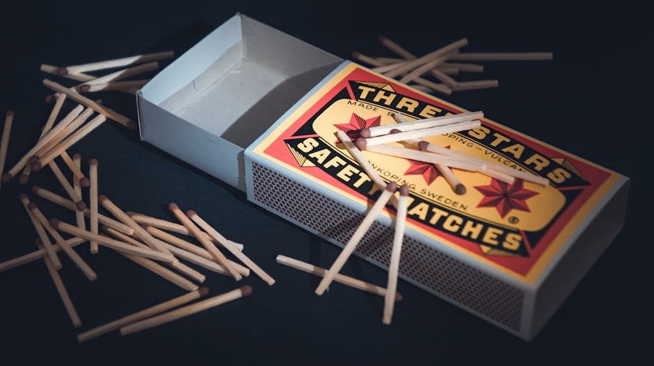

有人说：

> 西方直到 19 世纪才有火柴，所以他们古代一直茹毛饮血；今天还爱吃生牛排、生鱼片，不过是老祖宗留下来的原始习惯。

问题来了：火柴在中国民间称为“洋火”，是 1865 年从西方引进的，在没有“洋火”前，中国人难道在“茹毛饮血”？

既然中国人没有“茹毛饮血”，那凭什么说西方人发明火柴之前，在“茹毛饮血”？

火柴只是现代取火工具的一种。在它出现之前，人类照样有火镰、火石、火绒、保存火种这些办法。西方古人当然会生火、会做饭、会取暖，不然古希腊、古罗马、中世纪那么多成熟社会，难道都是靠啃生肉活下来的？

其实，这个人真正想说的是：“西方是蛮夷，中华有文明”。好吧，大清当年也是这么想的：英国人膝盖发育有缺陷，上岸都不能正常走路。

我实在搞不懂这些人到底是蠢还是坏：成天编造“西方人原始、未开化”、盗取《永乐大典》发展科技的谣言，目的是什么？是想带给我们文明优越感吗？殊不知啊，传递出的都是满满的屈辱感，想想看，若谣言为真，岂不是证明西方人聪明至极？

**造谣式爱国可以休矣，它不会带给我们文明优越感，只会增加屈辱感。**
