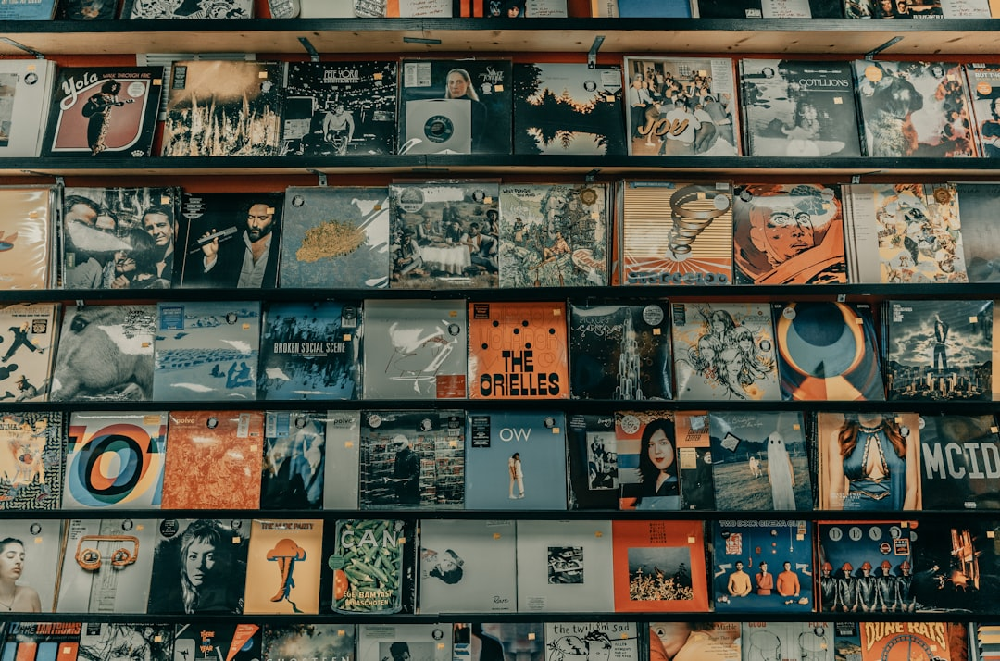

前几天，我看到一种观点：华语流行乐坛的衰落，是因为打击盗版，听歌开始收费。言下之意，只要让盗版回归，好歌自然就会回来。

将歌坛衰弱归因于打击盗版，这个逻辑实在感人。

假如这个因果关系成立，那么版权保护远比中国严格的西方流行乐坛，应该一直半死不活才对，哪会诞生那么多风靡全球的歌曲？

再看一个类似的例子：宋代的印刷术比唐代发达，复制与传播更加容易。可宋诗的整体成就，却公认不及唐诗。为什么更强的传播能力，却没有让宋诗超越唐诗？

由此可见，消费者能够方便、廉价地获取艺术作品，并不能积极促进艺术创作的繁荣。换句话说：盗版可以让一首好歌传播得更远更广，但一首好歌的诞生，与盗版没有直接的因果关系。

---

跳出错误逻辑，我们再看华语乐坛繁荣的真正根源，一个扎心的事实是：上世纪 80 年代到 90 年代末华语流行乐坛的繁荣，主要是由港台贡献的。

那时的港台，版权保护意识远远领先于大陆。正是基于这种意识，流行乐坛才逐步构建起了一套完整的“生态”——唱片公司投资搭平台，词曲作者持续供给内容，制作人打磨声音，歌手长期训练与定位，电台与电视放大作品，发行体系覆盖港台市场，正版销售带来稳定的现金流。

> 彼时，港台乐坛的这套生态，即便不依赖大陆市场，也能良好运行。

这套“生态”中的各个环节，并不是孤立存在的，它们相互依赖、相互强化。一首首好歌，看似是词曲作者的灵光乍现、歌手与歌的完美契合，实则是“生态”的必然产物。

港台当然也有盗版流传，可这只是发生在传播端的一个现象，对“生态”不构成致命损害。

有人会说，盗版也不是完全有害，它至少可以为歌曲积累知名度，带来日后的付费转化，类似于“补票”。然而，时隔多年后的补票，对当年急需现金流的创作者来说，已经没有任何意义，树都死了，你再来浇水。

反观大陆，在较长一段时间里，版权保护意识落后于港台，正版市场难以形成稳定回报，“生态”构建迟缓——缺乏稳定给予创作者现金报酬的机制，导致高质量内容不能稳定产出，因此对乐坛整体繁荣的贡献比较有限。

---

华语流行乐坛从繁荣开始衰退，本质是“生态”的劣化，原因是多重的，在此不展开讨论。但打击盗版，肯定不是导致衰退的原因，相反，它是试图修复生态的必要举措。

总之，把流行乐坛的繁荣归功于盗版，是错把传播能力当成了生产能力。你可以感谢盗版让你听了更多好歌，可你不能就此认为盗版有利于更多好歌的产生。

不过，当我们想明白上世纪 80 年代到 90 年代末乐坛的“神仙打架”只与时代共生，如同唐诗宋词般辉煌不可复制、衰落亦属必然，不妨就坦然接受吧。

---