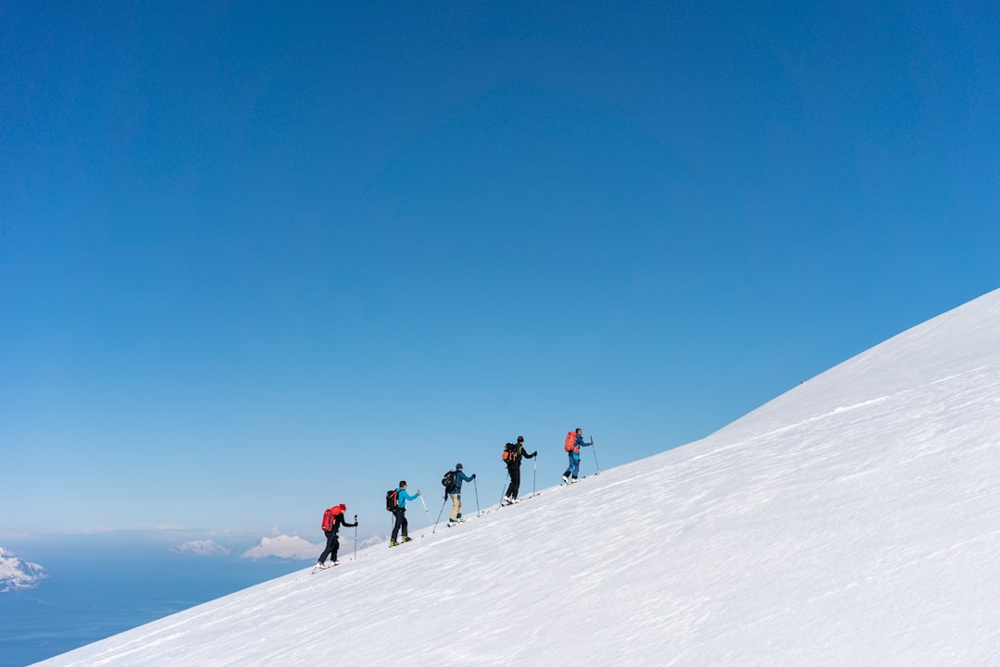

大家通常以为：谁创业成功了，说明他有能力、够努力；谁创业失败了，说明他不行、不够拼。也就是说创业靠的是“能力 + 努力”。

不过，但凡有些创业经验就会知道，创业从来不是一道加法题，而是一道乘法题：

> 创业 = 方向 × 能力 × 努力 × 运气。

以上四项里，任何一项为 0，结果就是 0。

>[!TIP]
>我对“创业成功”的定义，不是说一家企业短期风光，而是一家企业能活到十年以上。

---

**为什么创业是乘法，不是加法？**

创业不是一场短跑，而是创业者带领一群人去攀登一座从未探索过的山峰。

创业者知道山在那里，可云山雾罩，前路茫茫，一切都是未知，只能边走边看边判断。
作为领队，你要在漫长的攀登中一次又一次做出决策。
成功，需要你避开每一个致命错误；失败，往往只需要一次判断失误。

著名投资人阎焱提到过一个判断：个人创业成功率只有 1%。
这个数字本身就说明了问题。如果创业真的是“能力 + 努力”的加法游戏，成功率怎么会低到这个地步？世界上从来不缺少有能力又努力的人。
它之所以低，是因为创业者面对的不是单一变量竞争，你看：

- 方向错了，山选错了，爬得越快越危险
- 能力不够，捷径就在那里，你切不上去
- 不努力，停在半山腰，迟早被人超过
- 运气背了，一场雪崩，所有准备归零

这四个变量，哪一个归零都会导致登山失败。
显然，我们不能用加法来解释创业。

---

**OFO 小黄车不是死于方向错了**

共享单车这门生意，到今天还有人在做，说明其模式还有价值。
或许你会想：OFO 小黄车早死透透了，其他各家共享单车公司基本都卖身大公司了，还能有什么价值？
其实对大公司而言，共享单车的价值不是赚钱，而是这项高频应用的存在可以降低 App 的卸载率。

因此回头去看，我们不能说 OFO 小黄车的方向完全错了。尽管这家公司发展迅猛，存在着诸多的管理问题，但是毕竟它还支撑到了运气窗口为它打开的那一刻。

2017 年到 2018 年那个生死关头，投资人撮合 OFO 小黄车和竞争对手摩拜谈合并，像当年的滴滴和优步、美团和点评一样。
这情形好比是你已经掉到了谷底，此时有人从山上抛下了一根绳索。年轻气盛的创始人戴威拒绝了面前的这根救生强索。最终，他成了被限制高消费、背负千万骂名的失信执行人。

相比之下，摩拜的创始人胡玮炜就清醒许多。在意识到行业无法独立盈利、资本已经冷静时，她选择了接受美团的收购案，拿了 15 亿现金全身而退。

网易丁磊说过一句话：创业者要把自己的公司当儿子养，当猪卖。
前半句，戴威和胡玮炜都做到了。后半句，戴威做不到。

我相信戴威很聪明，能力也不差。他或许早已看清了局势，但是他的理性无法战胜个性，强烈的掌控让他在该出手的时候，出不了手。那扇运气窗口，就这样被他亲手关上了。

---

所以对创业最准确的理解只有一句话：

> 方向、能力、努力、运气，任何一项为 0，结果就是 0。

比起把公司当儿子养，创业者更难的是：应该把公司当猪卖的时候，下得去手。
创业者从自己创立的企业中全身而退，企业或事业存续，同样也是“创业成功”。

---
